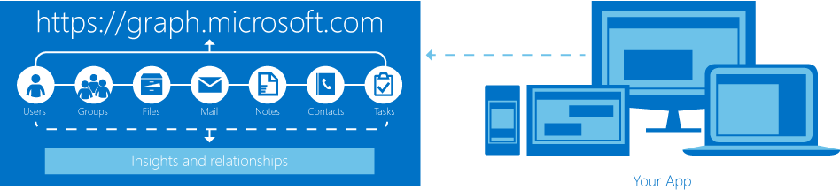

# Microsoft Graph Repository

Microsoft Graph is a single endpoint to interact with Office 365 and Microsoft cloud services.

Microsoft Graph (Microsoft API) allow to access data from cloud services such as Azure AD, 
Exchange, SharePoint Online OneDrive, Planner and others, navigate between entities.

## Get started

* [Microsoft Graph Documentation](https://graph.microsoft.io/en-us/docs)
* [Graph Explorer](https://graph.microsoft.io/en-us/graph-explorer). Try the API.

## About Me

I'm SharePoint Architect, Developer, Technical Trainer.
My [SharePoint Technical Blog](http://blog.vitalyzhukov.ru)
